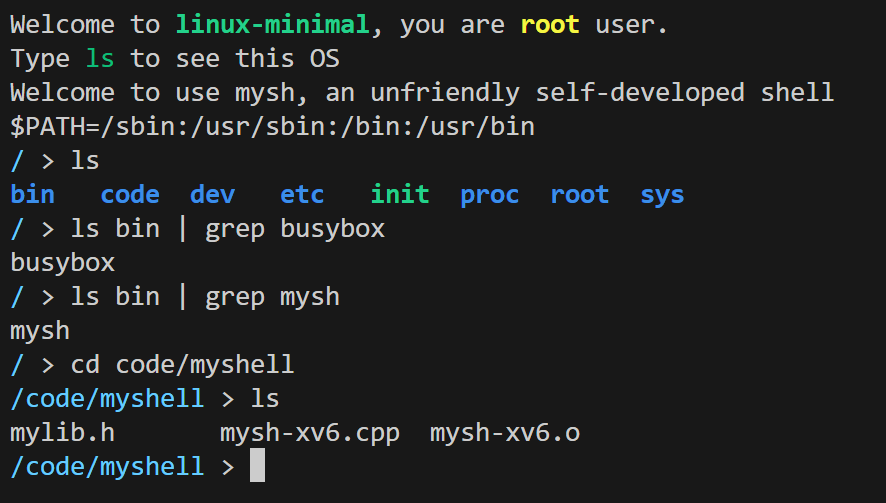

# Linux-minimal && myshell 
### How to use? 
```bash
make initramfs     # 编译并打包
make run-nographic # 以无图形化模式运行打包文件
```
> This will compile the project and launch QEMU for simulation. 
> For more details, you can refer to the `Makefile`. 

### How to close? 
- `Ctrl A` + `X` (simulated with QEMU)

### demo show 
