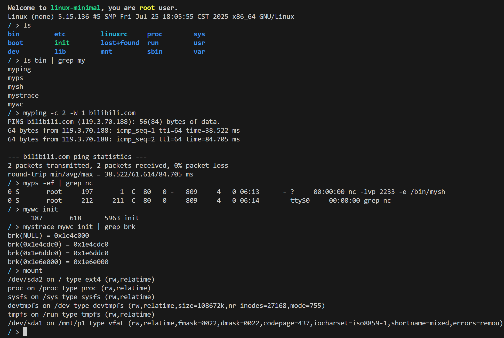

# Linux-minimal && myshell 

用于教学或实验的**极简Linux系统**与**自定义Shell**开发环境。提供了完整的构建系统，使用 `QEMU` 进行虚拟仿真 `x86_64` 和 `arm64` 架构的Linux系统。

### How to use? 
```bash
make help          # 查看所有可用命令
make build         # 使用默认配置（`ARCH=x86_64`, `MYSHELL=myshell-cpp`）编译构建项目
make run-nographic # 以无图形化模式运行系统（会把所有在 rootfs/ 中的文件拷贝到磁盘 `build/disk.img` 里）
make run           # 以图形化模式运行
make debug         # 启动QEMU并等待GDB连接，用于Linux内核调试
make run-bridge    # 不使用默认的USER网络模式，而是创建网桥供QEMU使用
make clean         # 清除所有构建产物
```
> This will compile the project and launch QEMU for simulation. 
> For more details, you can type `make help` or refer to the `Makefile`. 

### How to close? 
- `Ctrl A` + `X` (simulated with QEMU)
### How to add my own application?
- Create a new directory for your application in `usr-code/app/` and a Makefile.
- Add your application name to the `config.cfg` file.
- Execute `make run-nographic` to automatically build and run with your new app.

### demo show 


> P.S. 现阶段实现了 `mysh -nostdlib` 和 `mysh in cpp` 的两份 shell ，实现了 **环境变量 历史记录 Tab补全 命令行解析 管道操作 输入输出重定向** 等操作，可以在 Makefile 中查看并选择启动项。